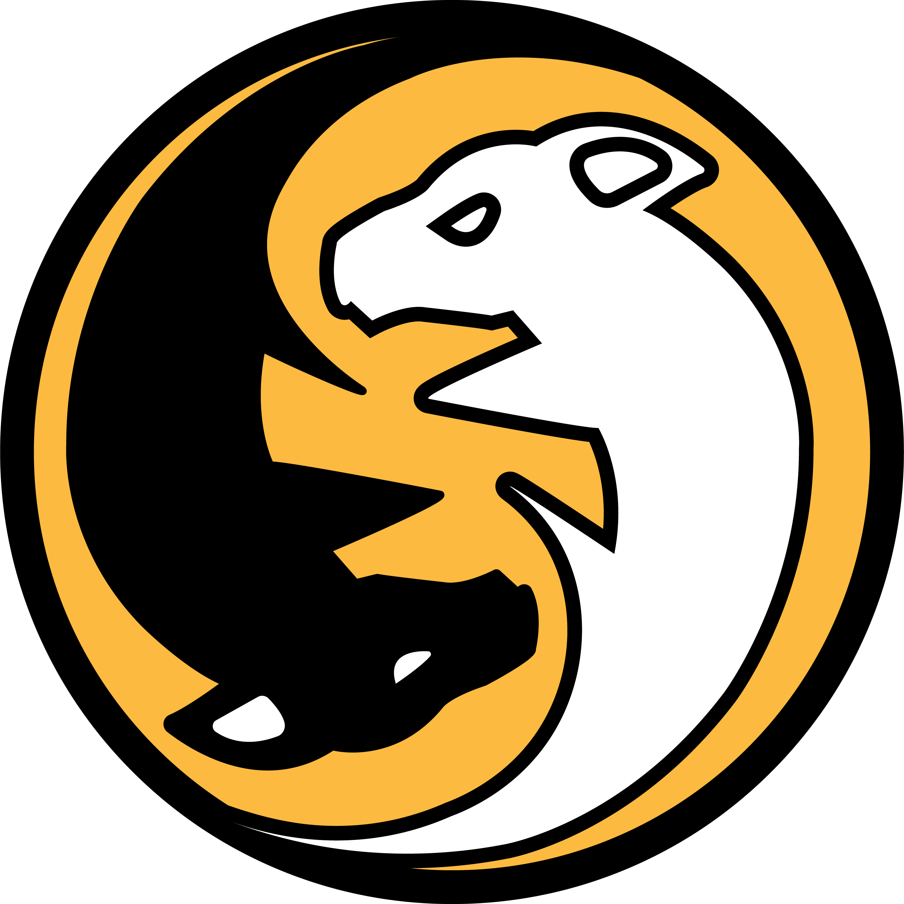
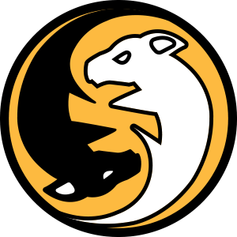
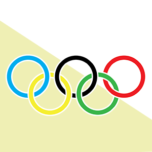

<!DOCTYPE html>
<html lang="en">
<head>
    <meta charset="UTF-8">
    <meta name="viewport" content="width=device-width, initial-scale=1.0">
    <title>Code Practice</title>
    <link rel="stylesheet" href="css/styles.css">
</head>
<body>
    <section id="Hero">
        

            <header class="flex-container">
                <h1 id="Site-Title">Roberto Rivera Creative. Graphic Design and Web Development.</h1>
                
                <nav>
                    <ul class="flex-container uppercase">
                        <li><a href="#">Home</a></li>
                        <li><a href="#">About</a></li>
                        <li><a href="#">Portfolio</a></li>
                        <li><a href="#">Hire Me</a></li>
                    </ul>
                </nav>
            </header>
            

                
<strong>Designer and Developer who creates Awsome art and design!</strong>

                <button class="btn-primary">Hire Me</button>
                <button class="btn-secondary">Learn More</button>
            

            
        

    </section>
    <section id="About">
        

            <h2>About Roberto</h2>
            

            

            
            <h3>Roberto Rivera</h3>
            
Designer and Developer

            
Louisville, KY

            

                
My name is Roberto Rivera. I am a Graphic Designer and Front-End Web Developer currently living in Louisville, KY. I am passionate about creating stunning desings and awesome web experiences. Having graduated from Western Kentucky University have a code louisville certification as of 2019, I am seeking opportunities to work with clients on fulfilling coding and design.

            

        

    </section>
    <section id="Portfolio">
        

            <h2>Portfolio</h2>
            

                
                
                
            

        

        </section>
    <section id="Hire">
        

            
Hire Me

        

    </section>
    <footer>
        

            <section id="footerSection">
            <h3>Roberto Rivera. Graphic Designer and Front-End Developer</h3>
            
&copy; 2019 All Rights Revserved

        </section>
        

    </footer>
</body>
</html>

@import url('https://fonts.googleapis.com/css?family=Source+Sans+Pro:400,700&display=swap');

* {
  box-sizing: border-box;
}

body{
  margin: 0;
  padding: 0;
  font-family: 'Source Sans Pro', sans-serif;
}

h1, h2, h3, h4, h5, h6, p, ul {
  margin: 0;
}

a, button {
    transition: all 150ms ease-in-out;
    cursor: pointer;
}

img { width: 100%; height: auto;}

#Site-Title {
  display: none;
}

#Logo {
    max-width: 80px;
}

#Hero {
    background: #f6a800 url('../img/hero-img.jpg') no-repeat top center;
    background-size: cover;
    background-blend-mode: multiply;
    position: relative;
    padding-top: 40px;
    padding-bottom: 40px;
    color: white;
    font-size: 3rem;
}

#Hero-Content {
    max-width: 600px;
    margin-top: 6rem;
    margin-bottom: 6rem;
}

#About {background-color: #00234d; color: white;}
#Portfolio {background-color: #00234d; color: white;}
#Hire {background-color: #f6a800;}
footer {background-color: #000000; color: white;}

.container {
  max-width: 1140px;
  width: 80%;
  margin: 0 auto; 
}

.uppercase {text-transform: uppercase;}

.flex-container { 
    display: flex;
    justify-content: space-between;
}

.btn-primary,
.btn-secondary {
    width: 280px;
    padding: 5px 10px;
    color: white;
    font-size: 1.5rem;
    font-weight: bold;
    text-transform: uppercase;
}

.btn-primary {
    background-color: #000000;
    padding: 9px 14px;
    border: 0;
}

.btn-primary:hover {
    background-color: #CA942F;
}

.btn-secondary {
    background-color: transparent;
    border: 5px solid white;
}

.btn-secondary:hover {
    background-color: rgba(255, 255, 255, .4);
}

nav ul {
    padding-left: 0;
}

nav ul li {
    list-style: none;
    margin-right: 18px;
}

nav a {
    text-decoration: none;
    display: block;
    font-size: 24px;
    color: white;
}

nav a:hover {
    color: black;
}

#brand {
    max-width: 900px;
    
}

#Profile {
  max-width: 500px;
}

#About-Text {width: 100%;}
  

#Portfolio .flex-container {
  flex-flow: row wrap-reverse;
  justify-content: center;
}

#Portfolio img:hover {
  border: 5px solid #777;
}

#Portfolio img {
  max-width: 250px;
  width: 100%;
  height: auto;
  background-color: white;
  border-radius: 8px;
  border: 5px solid transparent;
  margin: 5px;
  flex: auto;
}

div.desc {
  padding: 15px;
  text-align: center;
}

p {
    column-count: 2;
    column-gap: 10px;
}

.column {
    background: #ccc;
    display: table-cell;
    padding: 10px;
    width: 33.33333%;
    text-align: center;
 }
© 2020 GitHub, Inc.
Terms
Privacy
Security
Status
Help
Contact GitHub
Pricing
API
Training
Blog

